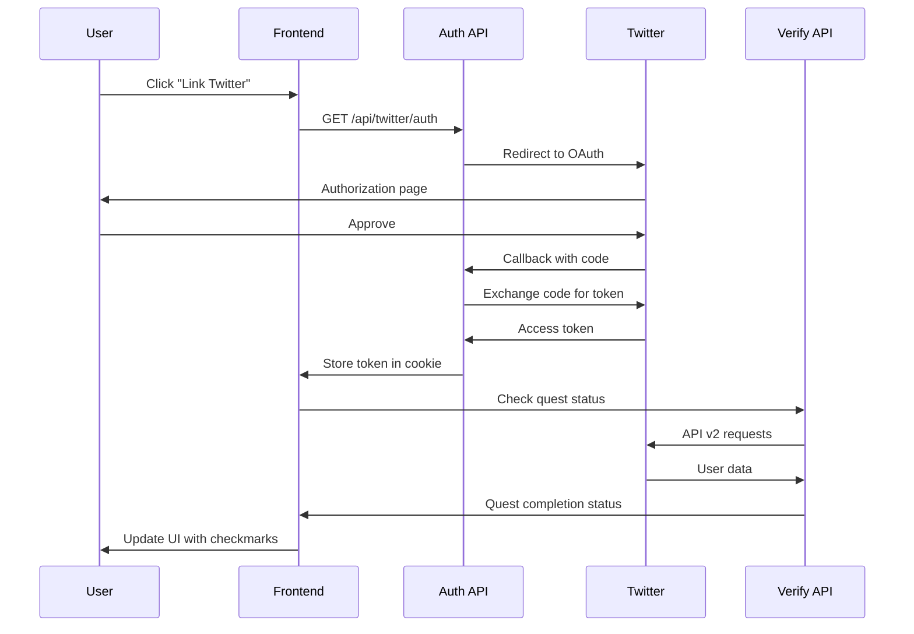

# Twitter API v2 Integration Guide

This document explains the complete Twitter API v2 integration based on the [official sample code repository](https://github.com/xdevplatform/Twitter-API-v2-sample-code).

## Overview

The application now includes full Twitter API v2 integration with automatic quest verification for:
- ✅ OAuth 2.0 authentication with PKCE
- ✅ Follow verification
- ✅ Like detection
- ✅ Retweet tracking
- ✅ Reply monitoring

## Architecture

### API Endpoints

#### Authentication Endpoints
- `/api/twitter/auth` - Initiates OAuth 2.0 flow
- `/api/twitter/callback` - Handles OAuth callback from Twitter
- `/api/twitter/verify-auth` - Checks authentication status
- `/api/twitter/logout` - Logs out user

#### Quest Verification Endpoints (NEW)
- `/api/twitter/check-follow` - Verifies if user follows an account
- `/api/twitter/check-like` - Checks if user liked tweets
- `/api/twitter/check-retweet` - Validates retweets
- `/api/twitter/check-reply` - Confirms replies

### How It Works



## Twitter API v2 Endpoints Used

Based on the [Twitter API v2 sample code](https://github.com/xdevplatform/Twitter-API-v2-sample-code):

### 1. User Lookup
```javascript
GET https://api.twitter.com/2/users/by/username/{username}
```
Used for: Finding user IDs from usernames

### 2. Following Lookup
```javascript
GET https://api.twitter.com/2/users/{id}/following
```
Used for: Checking if user follows @narrative_hq
Reference: [Follows-Lookup samples](https://github.com/xdevplatform/Twitter-API-v2-sample-code/tree/main/Follows-Lookup)

### 3. Liked Tweets
```javascript
GET https://api.twitter.com/2/users/{id}/liked_tweets
```
Used for: Verifying user liked posts
Reference: [Likes-Lookup samples](https://github.com/xdevplatform/Twitter-API-v2-sample-code/tree/main/Likes-Lookup)

### 4. User Timeline
```javascript
GET https://api.twitter.com/2/users/{id}/tweets
```
Used for: Finding retweets and replies
Reference: [User-Tweet-Timeline samples](https://github.com/xdevplatform/Twitter-API-v2-sample-code/tree/main/User-Tweet-Timeline)

## Implementation Details

### Frontend Integration

The `ReferralAccessGate` component now includes:

1. **Automatic Quest Verification**: When users link Twitter, all quests are automatically checked
2. **Manual Verification**: Users can click quest buttons to trigger verification
3. **Visual Feedback**: Checkmarks (✓) appear when quests are completed
4. **Smart Disabling**: Buttons are disabled until Twitter is linked

```typescript
// Auto-verify after Twitter linking
const checkTwitterAuth = useCallback(async () => {
  const response = await fetch('/api/twitter/verify-auth');
  const data = await response.json();
  if (data.authenticated) {
    setTwitterLinked(true);
    verifyTwitterQuests(); // Automatic verification
  }
}, []);

// Verify all quests
const verifyTwitterQuests = useCallback(async () => {
  const [follow, like, retweet, reply] = await Promise.all([
    fetch('/api/twitter/check-follow?username=narrative_hq'),
    fetch('/api/twitter/check-like?username=narrative_hq'),
    fetch('/api/twitter/check-retweet?username=narrative_hq'),
    fetch('/api/twitter/check-reply?username=narrative_hq'),
  ]);
  
  // Update quest states based on results
}, []);
```

### Backend Verification

Each verification endpoint follows this pattern:

1. **Extract access token** from secure HTTP-only cookies
2. **Call Twitter API v2** with proper authentication
3. **Parse response data** and check for matches
4. **Return verification status** to frontend

Example from `check-follow.ts`:

```typescript
// Get user ID from username
const userLookupResponse = await fetch(
  `https://api.twitter.com/2/users/by/username/${username}`,
  {
    headers: {
      Authorization: `Bearer ${accessToken}`,
    },
  }
);

// Check following list
const followingResponse = await fetch(
  `https://api.twitter.com/2/users/${userId}/following`,
  {
    headers: {
      Authorization: `Bearer ${accessToken}`,
    },
  }
);

const isFollowing = followingList.some(
  (user) => user.id === targetUserId
);
```

## Environment Variables

Required variables (already configured in your `.env`):

```env
# Twitter OAuth 2.0 Credentials
X_CLIENT_ID=your_oauth_client_id
X_CLIENT_SECRET=your_oauth_client_secret
X_REDIRECT_URI=http://localhost:3000/api/twitter/callback

# Twitter API v1.1 (for backward compatibility)
X_API_KEY=your_api_key
X_API_KEY_SECRET=your_api_secret
X_BEARER_TOKEN=your_bearer_token

# Optional security
NEXTAUTH_SECRET=your_random_secret
```

## Usage Flow

### For Users

1. **Join Waitlist** → Click "Join Waitlist" button
2. **Link Twitter** → Click "Link Your Twitter" (redirects to Twitter OAuth)
3. **Authorize** → Approve the application on Twitter
4. **Automatic Check** → System verifies completed quests
5. **Complete Quests** → Follow, like, retweet, reply as needed
6. **Manual Verification** → Click quest buttons to re-verify
7. **Instant Feedback** → See checkmarks when quests complete

### For Developers

#### Adding New Quest Verifications

To add a new quest type:

1. **Create new API endpoint** in `/src/pages/api/twitter/`:

```typescript
// Example: check-mention.ts
export default async function handler(req, res) {
  const { username } = req.query;
  const cookies = parse(req.headers.cookie || '');
  const accessToken = cookies.twitter_access_token;
  
  // Call Twitter API v2
  const response = await fetch(
    `https://api.twitter.com/2/users/${userId}/mentions`,
    {
      headers: { Authorization: `Bearer ${accessToken}` },
    }
  );
  
  // Return verification status
  return res.json({ mentioned: true/false });
}
```

2. **Update frontend** in `ReferralAccessGate.tsx`:

```typescript
// Add to verifyTwitterQuests
const mentionResponse = await fetch('/api/twitter/check-mention?username=narrative_hq');
const mentionData = await mentionResponse.json();
if (mentionData.mentioned) {
  setMentionedNarrative(true);
}
```

3. **Add UI component** for the new quest

## API Rate Limits

Twitter API v2 rate limits per 15-minute window:

| Endpoint | Rate Limit | Used For |
|----------|------------|----------|
| User Lookup | 300 requests | Finding user IDs |
| Following | 15 requests | Check follows |
| Liked Tweets | 75 requests | Check likes |
| User Timeline | 900 requests | Check retweets/replies |

**Recommendation**: Cache verification results for 5-10 minutes to avoid hitting rate limits.

## Testing

### Local Testing

1. Start development server:
```bash
npm run dev
```

2. Navigate to waitlist modal
3. Click "Link Your Twitter"
4. Authorize on Twitter
5. System auto-checks all quests
6. Manually perform actions on Twitter
7. Click quest buttons to re-verify

### Testing Checklist

- [ ] OAuth flow completes successfully
- [ ] Access token stored in secure cookie
- [ ] Follow verification works
- [ ] Like detection works
- [ ] Retweet tracking works
- [ ] Reply monitoring works
- [ ] Visual feedback (checkmarks) appears
- [ ] Buttons disabled before Twitter link
- [ ] Re-verification works after actions

## Security Features

Based on OAuth 2.0 best practices:

- ✅ **PKCE (Proof Key for Code Exchange)**: Prevents authorization code interception
- ✅ **State Parameter**: CSRF protection during OAuth flow
- ✅ **HTTP-Only Cookies**: Protects tokens from XSS attacks
- ✅ **Secure Cookies**: HTTPS-only in production
- ✅ **SameSite Attribute**: Additional CSRF protection
- ✅ **Token Rotation**: Refresh tokens for extended sessions

## Troubleshooting

### Common Issues

**Issue**: "Not authenticated" error
**Solution**: User needs to link Twitter first via OAuth

**Issue**: "Following verification fails"
**Solution**: 
- Check if user actually follows @narrative_hq
- Verify API rate limits not exceeded
- Check access token validity

**Issue**: "Rate limit exceeded"
**Solution**: 
- Implement caching for verification results
- Wait 15 minutes for rate limit reset
- Use pagination for large result sets

**Issue**: OAuth redirect fails
**Solution**:
- Verify `X_REDIRECT_URI` matches Twitter app settings exactly
- Check callback URL in Twitter Developer Portal
- Ensure HTTPS in production

## Production Deployment

### Pre-deployment Checklist

- [ ] Update `X_REDIRECT_URI` to production URL
- [ ] Add production callback URL in Twitter Developer Portal
- [ ] Set `NODE_ENV=production`
- [ ] Ensure HTTPS is enabled
- [ ] Test OAuth flow on production domain
- [ ] Monitor API rate limits
- [ ] Set up error tracking (Sentry, etc.)

### Environment Variables for Production

```env
X_REDIRECT_URI=https://yourdomain.com/api/twitter/callback
NODE_ENV=production
```

## Resources

- [Twitter API v2 Documentation](https://developer.twitter.com/en/docs/twitter-api)
- [Twitter API v2 Sample Code](https://github.com/xdevplatform/Twitter-API-v2-sample-code)
- [OAuth 2.0 PKCE Guide](https://developer.twitter.com/en/docs/authentication/oauth-2-0/authorization-code)
- [Twitter Developer Portal](https://developer.twitter.com/en/portal/dashboard)
- [Rate Limits Reference](https://developer.twitter.com/en/docs/twitter-api/rate-limits)

## API Tiers

The implementation works with Twitter's Free tier:
- ✅ OAuth 2.0 "Login with X" (Free)
- ✅ User lookup endpoints (Free)
- ✅ Following/Likes/Timeline endpoints (Free)

No paid tier required for basic functionality!

## Support

For issues:
- Check [Twitter API Status](https://api.twitterstat.us/)
- Visit [Twitter Developer Community](https://devcommunity.x.com/)
- Review [API Reference Docs](https://developer.twitter.com/en/docs/twitter-api/api-reference-index)

## Next Steps

Potential enhancements:
- [ ] Add caching layer for verification results
- [ ] Implement webhook for real-time verification
- [ ] Add analytics for quest completion rates
- [ ] Support for checking specific tweet IDs
- [ ] Batch verification for multiple users
- [ ] Admin dashboard for quest management


